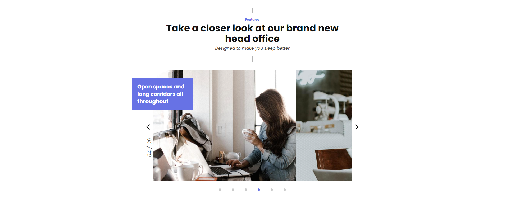

<h2> Custom JS slider and Gulp </h2>

<h3> RUN NPM SCRIPTS </h3>

<pre class="notranslate">
<code>$ npm install</code>
</pre>

<pre class="notranslate">
<code>$ npm run watch</code>
</pre>

The result is available in dist/ folder.

  
  

